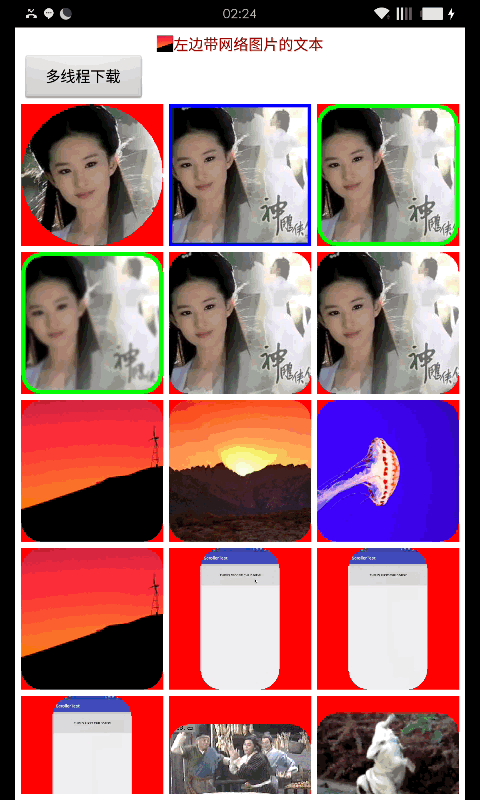

# lib_download
## 效果图


这是一个处理异步下载的库，包含图片加载，多文件多线程断点下载，http和ormgo(马天宇的开源)，特点如下：

全局公用一个线程池

非ImageView的view也支持哦

支持预加载：
```java 
BmLoader.preLoad(uri);
```

支持本地和网络图片，径格式示例为：
		```xml
		"http://img.blog.csdn.net/20160114230048304",
    		"assets://anim.gif",
                "drawable://"+R.drawable.anim,
                "file:///mnt/sdcard/paint.png",
                ```
优化了listview等快速滑动时的图片加载

圆角图采用了性能最优的方案

可设置模糊效果和头像识别自动剪裁功能

通过各种手段保障gridview等在有圆角和大量gif的情况下快速滑动时也能依旧极度流畅。

通过自定义的方式确保默认的加载中和加载失败的图片在任何形状的view中都能显示完整并且大小适当。

如果view使用或者继承download.imageLoader.view.GifMovieView这个类的话支持gif图，否则只能用回调自己自定义view实现。

设置自定义显示方法这样就可以实现各种功能如给textviw设置上下左右的图，给子view设置网络图片，给remoteview设置网络图片等等。
```java
Image.with(this).load("http://img.my.csdn.net/uploads/201407/26/1406383265_8550.jpg")
                .size(130, 130).blur(false)
                .customDisplay(new CustomDisplayMethod() {
                    @TargetApi(Build.VERSION_CODES.JELLY_BEAN_MR1)
                    @Override
                    public void display(Drawable bitmap, Movie movie) {
                        mTv.setCompoundDrawablesRelativeWithIntrinsicBounds(bitmap, null, null, null);
                    }
                }).into(mTv);
```
        
如果使用类download.imageLoader.view.GifMovieView，调用方法更简单了：
```java
view.rectangle().face(true).blur(false).setBorder(Color.BLUE, 15f).bind(uri);
view.circle().blur(false).setBorder(Color.BLACK, 0f).bind(uri);
view.round(50).blur(false).setBorder(Color.GREEN, 0f).bind(uri);
view.bind(uri)

```

断点下载 ：可多界面监听同一下载，恢复网络时自动恢复之前失败的下载，可指定各自的下载目录，带md5校验
```java
DownFileManager.getInstance(FileDownloadActivity.this).download(entry.url,new DownloadListener() {
                @Override
                public void success(String path) {
                    
                }

                @Override
                public void progress(int currentLen, int totalLen) {

                }

                @Override
                public void error(String errror) {

                }

                @Override
                public void pause() {

                }

                @Override
                public void cancel() {

                }
            });

```

HTTP模块：
```java
Http.with(this).url(url).progressDownload(new OnProgressDownloadListener() {
            @Override
            public void onProgressDownload(int curLength, int totalLength) {
                
            }
        }).progressUpdate(new OnProgressUpdateListener() {
            @Override
            public void onProgressUpdate(int curLength, int totalLength) {
                
            }
        }).callback(new JsonReaderListCallback<AppEntry>("data") {
            @Override
            public void onSuccess(ArrayList<AppEntry> result) {
                Log.e("test",""+result.size());
                for (int i = 0;i<result.size();i++){
                    DownFile downFile = new DownFile(result.get(i).url);
                    downFile = DownFileManager.getInstance(getApplicationContext()).initData(downFile);
                    mDownloadEntries.add(downFile);
                }
                adapter = new DownloadAdapter(result);
                mDownloadLsv.setAdapter(adapter);
            }
        }).get();
        
```
当返回数据较小时使用JsonCallback和JsonListCallback，当返回数据很大时为避免gson的oom请使用JsonReaderCallback和JsonReaderListCallback。也可以用CustomJsonReaderCallback自定义返回数据的处理。另外可以直接返回StringCallback或者返回文件路径FileCallback。

以上参考了有心课堂stay的视频http://www.stay4it.com/page/framework

下一步：继续完善并实现简单的线程自动切换框架

